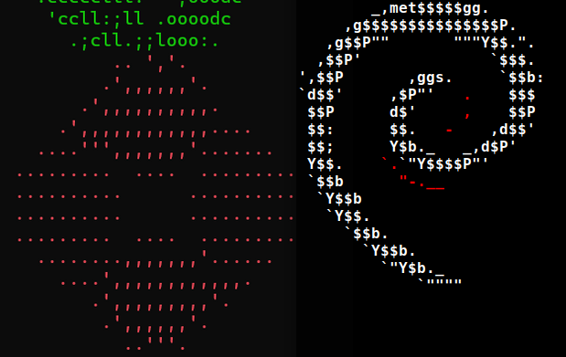
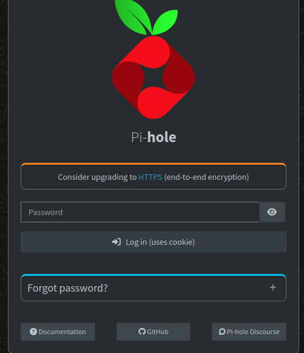
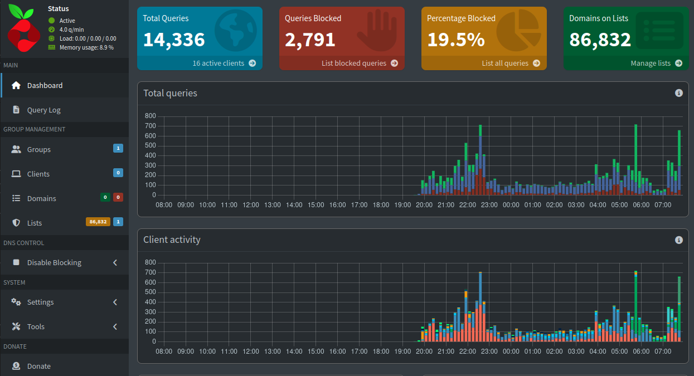
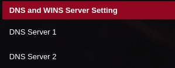
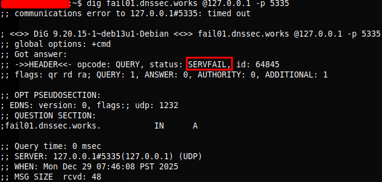
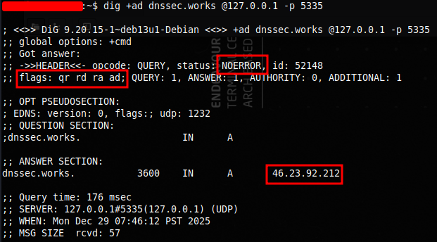

# PiHole-and-Unbound Install on Debian with the help of Ansible
I will be installing PiHole and Unbound on two of my Debian servers. One primary and one secondary in case of failure. I do not want to end up like Cloudflare... haha kidding. I will use Ansible so that I don't have to go in manually on both servers for the Unbound configuration. I can knock them both out at once.

<p align="center"></p>

## PiHole
Pi-hole is a network-wide ad-blocking and privacy tool that works by acting as a DNS sinkhole for your devices. Instead of installing ad blockers on each individual device, Pi-hole runs on a server and filters DNS requests for the entire network, blocking ads, trackers, and malicious domains before they ever reach your devices.

## Unbound
Unbound is a validating, recursive, caching DNS resolver focused on security, privacy, and performance. Rather than forwarding DNS queries to third-party providers (Cloudflare and Google), Unbound resolves domain names directly by querying the root DNS servers and working its way down the DNS hierarchy (recursively). It supports DNSSEC validation, ensuring that DNS responses have not been tampered with, and minimizes data exposure by avoiding reliance on external resolvers. Unbound is commonly paired with Pi-hole to create a fully local, private DNS solution.

## Ansible
Ansible is an open-source automation and configuration management tool used to manage systems, deploy applications, and enforce consistent configurations across multiple machines. It uses simple, human-readable YAML files called playbooks and operates over SSH without requiring agents on managed nodes.

## Install PiHole
***Make sure the servers you are using are set to a static IP. Use the DHCP setting of router or user nmtui/nmcli if using NetworkManager.***

[PiHole Install Docs](https://docs.pi-hole.net/main/basic-install/)

Intsalling is very simple and you can see how to do so via the link above. There are four ways to do so, but this is one way: 
```shell
$ curl -sSL https://install.pi-hole.net | bash
```
After running the command it will start the install script and run you through the setup TUI. It is very easy to use and it mostly just selecting simple options. After the setup TUI is done go ahead and change the password so you can log into the browser interface.
```shell
$ sudo pihole setpassword <password>
```
After setting your password you can now visit "server_IP/admin" to login for the first time and view the dashboard in your preferred browser.
<p align="center"></p>
<p align="center"></p>


***Afterwards make sure to go into your router DNS settings and enter your servers IP***
<p align="center"></p>

Test DNS
```shell
$ dig @PI-HOLE_IP_ADDRESS www.google.com
```

PiHole is now installed and it's that simple. You can leave off here as the rest is optional. 

## Install Unbound
Installing Unbound adds a bit more complexity, but is well worth it especially since you will learn more by doing more. I read through the documentation on PiHole of Unbound (link below) and realized it's not too bad to setup. I then started creating my Ansible playbook while I read through the documentation as it made it much easier to just run the one Ansible command versus manually going in to each Debian server and doing all the configurations one by one. 

[Unbound Install Docs](https://docs.pi-hole.net/guides/dns/unbound/)

This is the playbook I used. It might not be very portable, but it works perfect for my small network. In my ansible.cfg file I have "become=true" so that this playbook runs as root. 
```yaml
---
- name: Install unbound
  hosts: all
  tasks:
    - name: Install unbound latest
      ansible.builtin.apt:
        name: 
          - unbound
          - unbound-anchor
        state: latest
        update_cache: true
      register: output

    - name: Print install output
      debug:
        var: output.stdout_lines

    - name: Get root.hints and save to a file
      ansible.builtin.get_url:
        url: https://www.internic.net/domain/named.root
        dest: /var/lib/unbound/root.hints

    - name: Create unbound log dir
      ansible.builtin.file:
        path: /var/log/unbound
        state: directory
   
    - name: Create unbound log file
      ansible.builtin.file:
        path: /var/log/unbound/unbound.log
        state: touch
        owner: unbound

    - name: Add AppArmor exception
      ansible.builtin.copy:
        content: /var/log/unbound/unbound.log rw,
        dest: /etc/apparmor.d/local/usr.sbin.unbound

    - name: Restart AppArmor
      ansible.builtin.shell: apparmor_parser -r /etc/apparmor.d/usr.sbin.unbound && service apparmor restart

    - name: Configure unbound 
      ansible.builtin.copy:
        src: pi-hole.conf
        dest: /etc/unbound/unbound.conf.d/pi-hole.conf
      notify: Restart unbound

    - name: Fix so-rcvbuf warning in unbound
      ansible.builtin.copy:
        content: net.core.rmem_max=1048576
        dest: /etc/sysctl.d/99-unbound.conf
      notify: Restart sysctl

  handlers:
    - name: Restart unbound
      ansible.builtin.service:
        name: unbound
        state: restarted

    - name: Restart sysctl
      ansible.builtin.service:
        name: systemd-sysctl
        state: restarted
```
Here is the unbound pi-hole.conf file that Unbound will use. You can find this in the PiHole Docs:
```yaml
server:
    # If no logfile is specified, syslog is used
    logfile: "/var/log/unbound/unbound.log"
    log-time-ascii: yes
    verbosity: 2

    interface: 127.0.0.1
    port: 5335
    do-ip4: yes
    do-udp: yes
    do-tcp: yes

    # May be set to no if you don't have IPv6 connectivity
    do-ip6: yes

    # You want to leave this to no unless you have *native* IPv6. With 6to4 and
    # Terredo tunnels your web browser should favor IPv4 for the same reasons
    prefer-ip6: no

    # Use this only when you downloaded the list of primary root servers!
    # If you use the default dns-root-data package, unbound will find it automatically
    root-hints: "/var/lib/unbound/root.hints"

    # Trust glue only if it is within the server's authority
    harden-glue: yes

    # Require DNSSEC data for trust-anchored zones, if such data is absent, the zone becomes BOGUS
    harden-dnssec-stripped: yes

    # Don't use Capitalization randomization as it known to cause DNSSEC issues sometimes
    # see https://discourse.pi-hole.net/t/unbound-stubby-or-dnscrypt-proxy/9378 for further details
    use-caps-for-id: no

    # Reduce EDNS reassembly buffer size.
    # IP fragmentation is unreliable on the Internet today, and can cause
    # transmission failures when large DNS messages are sent via UDP. Even
    # when fragmentation does work, it may not be secure; it is theoretically
    # possible to spoof parts of a fragmented DNS message, without easy
    # detection at the receiving end. Recently, there was an excellent study
    # >>> Defragmenting DNS - Determining the optimal maximum UDP response size for DNS <<<
    # by Axel Koolhaas, and Tjeerd Slokker (https://indico.dns-oarc.net/event/36/contributions/776/)
    # in collaboration with NLnet Labs explored DNS using real world data from the
    # the RIPE Atlas probes and the researchers suggested different values for
    # IPv4 and IPv6 and in different scenarios. They advise that servers should
    # be configured to limit DNS messages sent over UDP to a size that will not
    # trigger fragmentation on typical network links. DNS servers can switch
    # from UDP to TCP when a DNS response is too big to fit in this limited
    # buffer size. This value has also been suggested in DNS Flag Day 2020.
    edns-buffer-size: 1232

    # Perform prefetching of close to expired message cache entries
    # This only applies to domains that have been frequently queried
    prefetch: yes

    # One thread should be sufficient, can be increased on beefy machines. In reality for most users running on small networks or on a single machine, it should be unnecessary to seek performance enhancement by increasing num-threads above 1.
    num-threads: 1

    # Ensure kernel buffer is large enough to not lose messages in traffic spikes
    so-rcvbuf: 1m

    # Ensure privacy of local IP ranges
    private-address: 192.168.0.0/16
    private-address: 169.254.0.0/16
    private-address: 172.16.0.0/12
    private-address: 10.0.0.0/8
    private-address: fd00::/8
    private-address: fe80::/10

    # Ensure no reverse queries to non-public IP ranges (RFC6303 4.2)
    private-address: 192.0.2.0/24
    private-address: 198.51.100.0/24
    private-address: 203.0.113.0/24
    private-address: 255.255.255.255/32
    private-address: 2001:db8::/32
```
You can read about the setting in man pages and unbound example docs. Run these commands to see:
```shell
$ dpkg -L unbound # List files installed to your system from unbound
$ /usr/share/doc/unbound/examples/unbound.conf # See config examples with comments
```

After running the playbook unbound will be installed and running. 
```shell
$ dig pi-hole.net @127.0.0.1 -p 5335 # test that it's operational
```

You can test DNSSEC validation using
```shell
$ dig fail01.dnssec.works @127.0.0.1 -p 5335

$ dig +ad dnssec.works @127.0.0.1 -p 5335
```

The first command should give a status report of "SERVFAIL" and no IP address.
<p align="center"></p>

The second should give "NOERROR" plus an IP address in addition to a "ad" in the "flags:" section. The "ad" signifies (Authentic Data), indicating the DNS response has been authenticated and validated using DNSSEC.
<p align="center"></p>

## Troubleshooting
Initially I could not get DNSSEC working. It kept saying my key wasn't secure and so I generated another key. It still continued to fail. I already had a new router coming in that same day to replace my ISP's hardware and after I installed it I tried again. I had the same error. So I figured i'd uninstall and start fresh. I then re-installed everything again and this time it worked without any additional steps. I saw online I wasn't the only peson with the issue, but didn't see anyone with a fix. So go buy a new router.... kidding  
```shell
# autoremove is used to remove packages that were automatically installed to satisfy dependencies
# Removing a package removes all packaged data, but leaves usually small (modified) user configuration files behind, in case the remove was an accident. 
# On the other hand you can get rid of these leftovers by calling purge even on already removed packages
$ sudo apt purge --autoremove unbound
```
